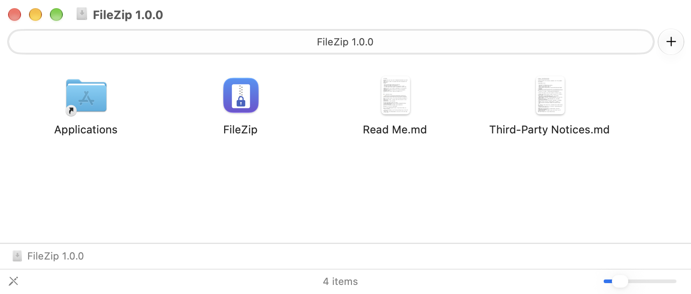
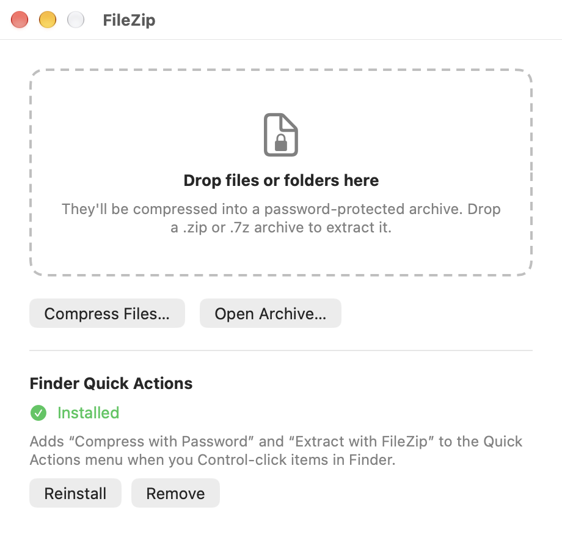
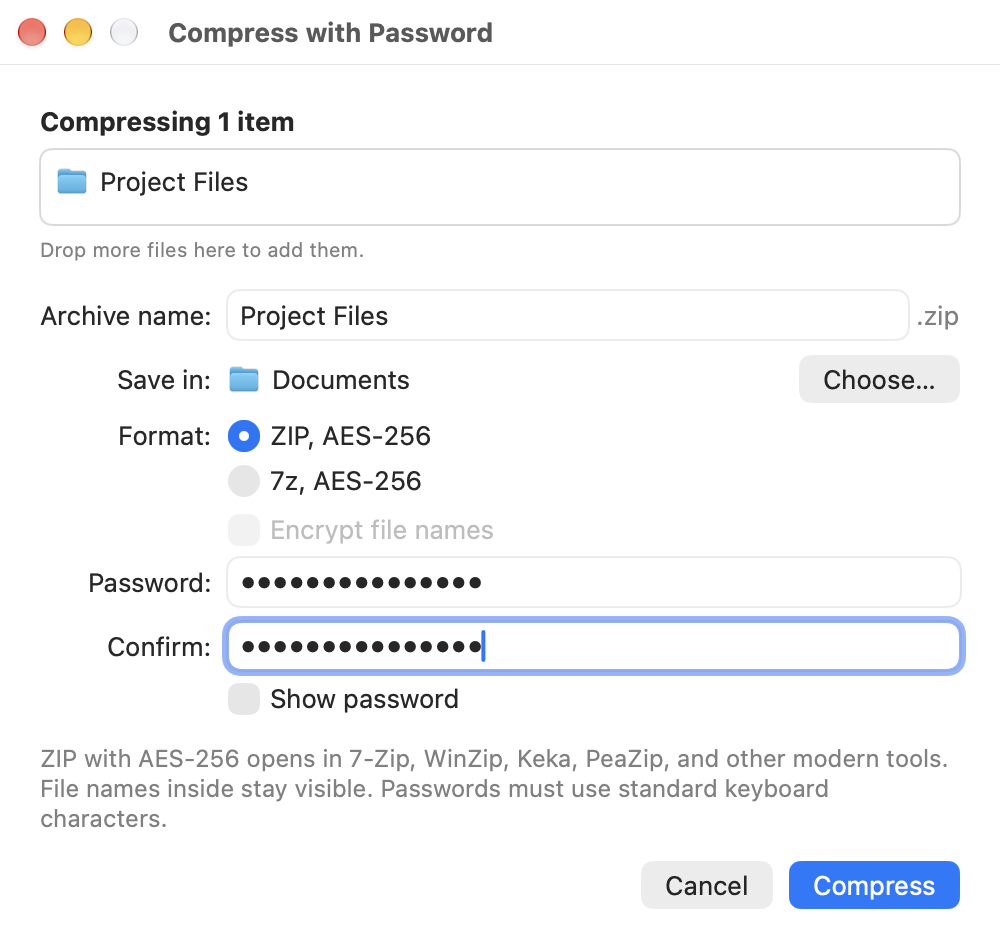
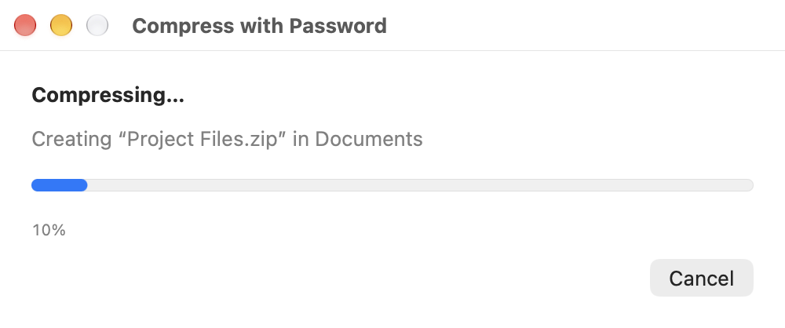
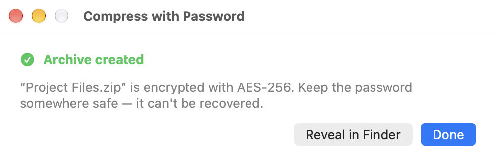
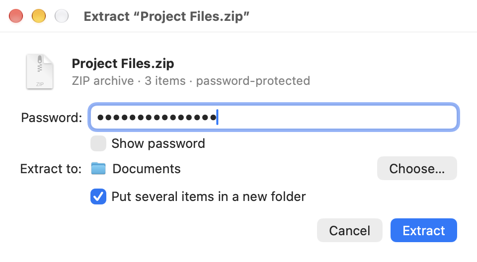
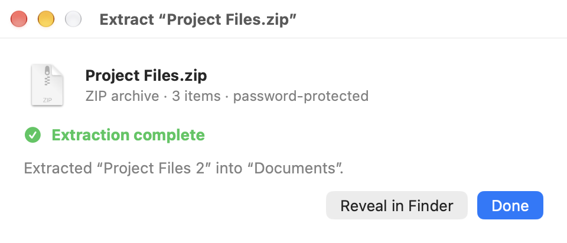
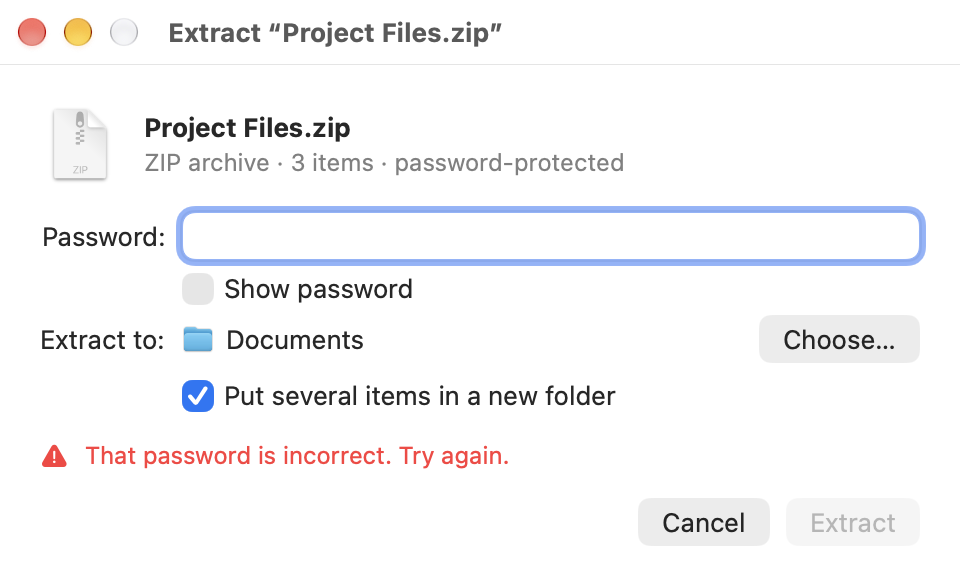

# FileZip

FileZip puts your files into a **password-protected zip file** with a
right-click in Finder. Only people who know the password can open what's
inside.

- It's free and works without the internet.
- Nothing else needs to be installed.
- It works on any Mac with macOS 13 (Ventura) or newer.
- It takes about 7 MB of space. The download is about 3 MB.

**Where to get it:** FileZip is published in its own public repository,
**[github.com/dwdas9/FileZip](https://github.com/dwdas9/FileZip)**. The
download link in step 1 takes you straight to it.

---

## 1. Download FileZip

👉 **[Click here to download FileZip](https://github.com/dwdas9/FileZip/releases/download/v1.0.0/FileZip-1.0.0.dmg)**

Your web browser saves a file called **FileZip-1.0.0.dmg** to your
**Downloads** folder. If Safari asks *"Do you want to allow downloads on
github.com?"*, click **Allow**.

(If the link doesn't work, go to the
[FileZip download page](https://github.com/dwdas9/FileZip/releases/tag/v1.0.0)
and click **FileZip-1.0.0.dmg** under **Assets**.)

### Where is the file I downloaded?

It's in your **Downloads** folder. To open that folder, do either of these:

- Click the **Finder** icon (the blue smiling face) at the left end of the
  Dock, then click **Downloads** in the list on the left side of the window.
- Or click the **Downloads** icon near the Trash, at the right end of the Dock.

If someone sent you the file by AirDrop, it's in Downloads too. If it came
by email, double-click the attachment in the email.

---

## 2. Install FileZip

1. Double-click **FileZip-1.0.0.dmg** (in your Downloads folder). After a few
   seconds a window opens showing the **FileZip** icon and an **Applications**
   folder.
2. Drag the **FileZip** icon onto the **Applications** folder. This copies
   FileZip onto your Mac.
3. Close that window. In Finder's sidebar, click the eject button (⏏) next to
   "FileZip 1.0.0". You can now move FileZip-1.0.0.dmg to the Trash; it isn't
   needed anymore.
4. Open FileZip: in Finder, click **Applications** in the sidebar, then
   double-click **FileZip**.

*This window opens when you double-click FileZip-1.0.0.dmg. Drag **FileZip**
onto **Applications**.*

### If your Mac says FileZip "cannot be opened" or "was blocked"

This is normal the first time. FileZip isn't registered with Apple (that costs
money). You only need to do this once:

1. Click **Done** (or **OK**) on the message.
2. Open **System Settings** (the gear icon) and click **Privacy & Security**.
3. Scroll down until you see *"FileZip" was blocked…*, then click
   **Open Anyway**.
4. Enter your Mac password if asked, then click **Open Anyway** again.

Don't turn off your Mac's security settings to do this. The button above is
enough.

---

## 3. Turn on the right-click option (one time)

1. Open FileZip.
2. In the FileZip window, click **Install Quick Actions**.
3. The window now says **Installed**. You can close FileZip.

*The FileZip window after clicking **Install Quick Actions**.*

If the option doesn't appear in the next step, wait a minute or restart your
Mac.

---

## 4. Make a password-protected zip

1. In Finder, select the files or folders you want to protect. To select
   several, hold the **Command (⌘)** key while you click them.
2. **Right-click** the selection. (Or hold **Control** and click.)
3. Choose **Quick Actions**, then **Compress with Password**.
4. In the window that opens:
   - **Archive name:** the name of the new file. You can change it.
   - **Save in:** where it will be saved. It's normally the same folder as
     your files.
   - **Format:** leave it on **ZIP** unless you know you want 7z (see below).
   - **Password** and **Confirm:** type the same password in both boxes. Tick
     **Show password** to see what you typed.
5. Click **Compress**.
6. When you see **Archive created**, click **Reveal in Finder** to see the new
   file, or **Done**.

*Step 4: the window that opens. The password is typed twice (shown as dots).*

*While it works, a progress bar shows. **Cancel** stops it safely.*

*Done. The new file sits next to your original files.*

Your original files stay exactly as they were. FileZip makes a new, separate
file.

**Write your password down somewhere safe.** If you forget it, nobody can open
the file — not even FileZip.

Other ways to start: drag files onto the FileZip window or onto its icon in
the Dock.

### ZIP or 7z?

- **ZIP** (recommended): works with more apps. The names of the files inside
  can be seen without the password, but the files themselves are locked. The
  password can only use normal keyboard letters, numbers, and symbols.
- **7z**: also hides the file names. The password can use any characters.
  The person receiving it needs an app such as 7-Zip, Keka, or The Unarchiver.

---

## 5. Open a password-protected file

1. Right-click the file in Finder and choose **Quick Actions ▸ Extract with
   FileZip**. Or drag the file onto FileZip.
2. Type the password and click **Extract**.
3. Click **Reveal in Finder** to see your files.

*Type the password, then click **Extract**.*

*Finished. A folder named "Project Files" already existed, so FileZip named the
new one "Project Files 2" instead of overwriting it.*

FileZip never overwrites files you already have. If a file with the same name
exists, the new one gets a number, like "Report 2.pdf".

**Note:** double-clicking a password-protected zip in Finder shows an error.
That's a limit of the Mac's built-in unzip tool. Use FileZip instead.

---

## 6. Sending a protected file to someone

- Send the file (by email, chat, USB drive, and so on), and tell them the
  password **separately**: by phone, or a different app. Don't send the
  password in the same email.
- Windows and Mac users may need a free app to open it: **7-Zip** (Windows),
  **Keka** or **The Unarchiver** (Mac). Mac users can also install FileZip
  using the download link in step 1. Windows' and Mac's built-in unzip tools
  can't open password-protected zips made this way.

---

## Questions

**My Mac asks whether FileZip may access files in Desktop, Documents, or
Downloads.**
Click **Allow**. FileZip needs this to read and save your files. It doesn't
send anything anywhere.

**It says the password is incorrect.**
Check Caps Lock and try again. Passwords are case-sensitive: "Cat" and "cat"
are different.

**How do I stop a long job?**
Click **Cancel**. Nothing half-finished is left behind.

**"Quick Actions" doesn't show FileZip.**
Make sure you clicked **Install Quick Actions** (step 3), then restart your
Mac. You can also check that it's switched on: right-click any file ▸
**Quick Actions ▸ Customize…**.

**Can FileZip open RAR files?**
No. It opens ZIP, 7z, TAR, GZ, BZ2, and XZ files.

---

## Removing FileZip

1. Open FileZip and click **Remove** (next to Quick Actions).
2. Quit FileZip.
3. Drag **FileZip** from your Applications folder to the Trash.

Archives you made are not affected. They're ordinary files.

---

*FileZip uses 7-Zip, made by Igor Pavlov. See [Third-Party Notices](THIRD_PARTY_NOTICES.md)
for its license.*
